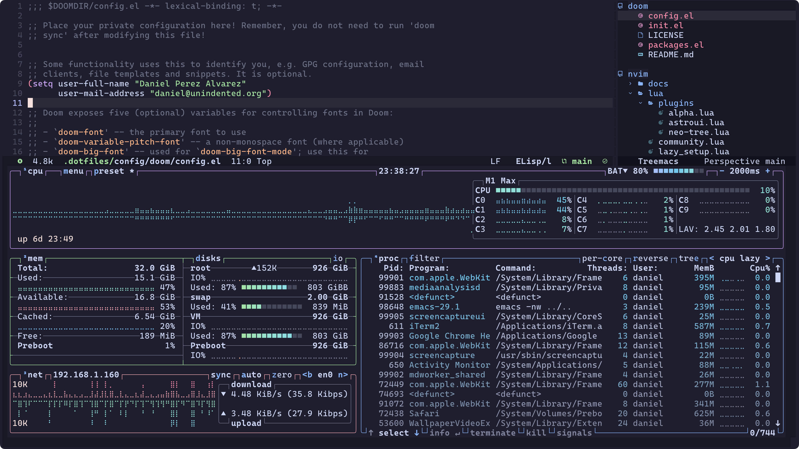

# Doom Emacs Config

My [Emacs](https://www.gnu.org/software/emacs/) / [Doom Emacs](https://github.com/doomemacs/doomemacs) config.



## Installation

Clone this repo into `~/.config/doom`:

```
git clone https://github.com/unindented/doomemacs-config.git ~/.config/doom
```

Remember to sync your settings:

```
doom sync
```

## Meta

- Code: `git clone https://github.com/unindented/doomemacs-config.git`
- Home: <https://github.com/unindented/doomemacs-config>

## Contributors

Daniel Perez Alvarez ([daniel@unindented.org](mailto:daniel@unindented.org))

## License

Copyright (c) 2024 Daniel Perez Alvarez ([unindented.org](https://www.unindented.org/)). This is free software, and may be redistributed under the terms specified in the LICENSE file.
